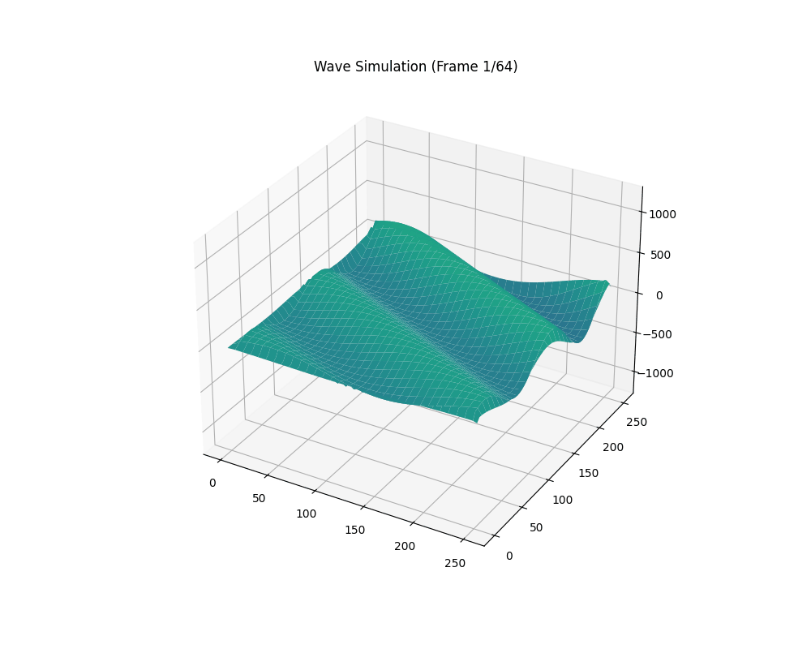

# 2D-WAVE

A CUDA implementation of the 2D wave equation, solved with a shared-memory tiling scheme and visualized as an animated 3D surface plot.



## Overview

This project simulates a wave propagating across a 2D plate by numerically solving the 2D wave PDE on the GPU. It's a direct evolution of an earlier [2D heat equation solver](https://github.com/Rishi-bitwise) I wrote, and reuses most of that project's shared-memory tiling strategy — the core difference is that the wave equation is second-order in time, so each update needs **two** previous time steps instead of one.

The finite-difference update at each grid point looks like:

```
u(t+1) = 2*u(t) - u(t-1) + R * (u_left + u_right + u_up + u_down - 4*u(t))
```

where `R` is the discretized Courant-type coefficient. Compare this to the heat equation's single-history update:

```
u(t+1) = u(t) + R * (u_left + u_right + u_up + u_down - 4*u(t))
```

The extra `u(t-1)` term is what makes the wave equation genuinely oscillate instead of diffusing to equilibrium — and it's also what drove the biggest design change from the heat solver (see [Design Notes](#design-notes) below).

## How it works

- The plate is a `SIDE x SIDE` grid (default `256 x 256`).
- The grid is split into `16x16` thread-block tiles.
- Each block loads a halo region of neighboring tiles into shared memory (`shmem`), sized by `SHLOOPDIM` (currently `3`, meaning a 3x3 arrangement of tiles per block — the center tile plus one ring of neighbors).
- Within that shared-memory region, the block iterates `HALO2` time steps locally before writing back to global memory. This amortizes the cost of the halo load over multiple time steps instead of re-fetching from global memory every step.
- `shbx` / `shby` hold boundary values between adjacent tiles *within* the shared-memory block so that a tile can read its neighbor's already-updated values without needing a full block-wide sync barrier per pair.
- Because the wave equation needs a second time step of history, a `d_scratch` buffer in global memory acts as a per-tile "scratchpad" that persists the previous shared-memory state (`u(t-1)`) across kernel launches. Each tile owns its own `SHMEMDIM x SHMEMDIM` region of `d_scratch`.
- Boundary conditions are fixed-value (Dirichlet), controlled by `BOUNDARY_TEMP` (named for historical reasons — carried over from the heat-equation code).

Output is written frame-by-frame to `2d_wave.csv`, where each row is one flattened `SIDE x SIDE` snapshot of the plate.

## Design notes

The comments in `2D-wave.cu` walk through the shared-memory budget calculations in detail (why `TILESIZE=16` with a `5`-tile loop dimension fits within a 32KB/48KB shared-memory block, and the tradeoffs of tile sizing vs. SM occupancy). A few points worth calling out:

- **Why a scratchpad instead of extending the heat solver's shared-memory-only approach:** the heat equation only needs the current time step in shared memory. The wave equation additionally needs the value from *before* that, which won't fit alongside everything else in shared memory for a nontrivial `SHLOOPDIM`. Rather than compress the halo further, `d_scratch` offloads that second history buffer to global memory, keyed per-tile so each block only touches its own region.
- **Pointer-swapping instead of copying:** `d_in`/`d_out` and `d_past`/`d_out_past` are swapped by pointer after each kernel launch rather than copied, avoiding an extra `cudaMemcpyDeviceToDevice` per step.
- **`__threadfence_block()` before the final `__syncthreads()`** inside the update loop ensures all warps have finished writing to `d_scratch` before the next tile in the loop reads from it.

## Visualization

`visuals.py` reads `2d_wave.csv` and renders it as an animated 3D surface plot (`matplotlib`'s `plot_surface`, saved via `PillowWriter`).

```bash
python visuals.py
```

Key parameters at the top of the script:

| Variable | Purpose |
|---|---|
| `SIDE` | Must match `SIDE` in the CUDA source |
| `MAX_FRAMES` | Number of time-step frames to render (kept small to limit GIF size) |
| `STRIDE` | Spatial downsampling factor for rendering speed |
| `FPS` | Animation playback speed |

## Building and running

This was developed and run in a `%%cuda` cell (e.g. via `nvcc4jupyter` in a Colab/Jupyter notebook). To run standalone with `nvcc`:

```bash
nvcc 2D-wave.cu -o wave_sim
./wave_sim
python visuals.py
```

This produces `2d_wave.csv` (raw simulation data) and `wave_simulation.gif` (rendered animation).

## Parameters

All tunable via `#define`s at the top of `2D-wave.cu`:

| Parameter | Description | Default |
|---|---|---|
| `SIDE` | Plate dimension (SIDE x SIDE grid) | 256 |
| `TOTAL_TIME` | Total simulated time steps | 1024 |
| `TILESIZE` | Thread block tile size | 16 |
| `SHLOOPDIM` | Shared-memory tile loop dimension (must be odd) | 3 |
| `KERNEL_TIME_SKIPS` | Kernel launches per recorded frame | 1 |
| `R` | Wave equation coefficient | 0.125 |
| `BOUNDARY_TEMP` | Fixed boundary value | 0.0 |

## Repo structure

```
2D-WAVE/
├── 2D-wave.cu              # CUDA source: simulation kernels + host driver
├── visuals.py               # Reads the CSV output and renders a 3D animated GIF
└── wave_simulation(4).gif   # Example rendered output
```
